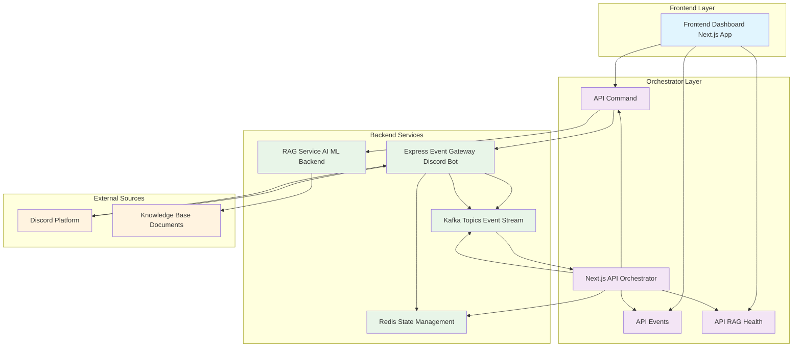
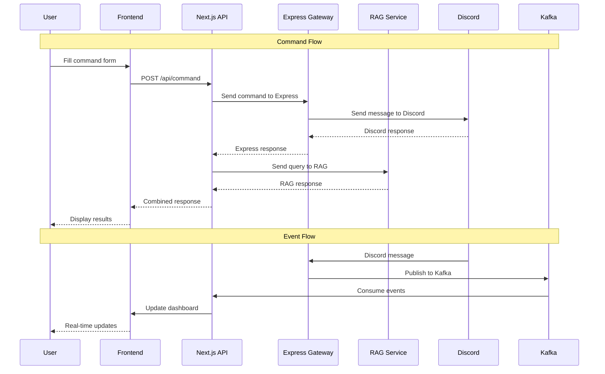
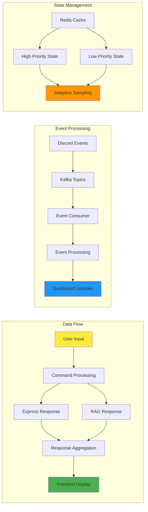
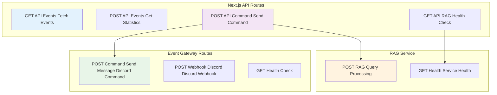

# Talita Titania Control System

Sistem kontrol fullstack yang menggunakan **Next.js sebagai orchestrator** untuk mengintegrasikan Discord bot, RAG (Retrieval-Augmented Generation), dan frontend dashboard.

## 🏗️ Arsitektur



## 🔄 Flow Data



## 📊 System Components



## 🔧 API Architecture



## 📁 Struktur Project

```
talita-titania-controll/
├── app/                          # Next.js App Router
│   ├── api/
│   │   ├── command/              # Command API (Express + RAG)
│   │   ├── events/               # Events API (Kafka events)
│   │   └── rag/health/           # RAG Health Check
│   ├── lib/
│   │   ├── kafka-consumer.ts     # Kafka consumer & Express client
│   │   ├── rag-service.ts        # RAG service integration
│   │   └── worker.ts             # Background worker
│   └── page.tsx                  # Frontend dashboard
├── event-gateway/                # Express.js + Discord Bot
│   ├── src/
│   │   ├── bot.ts               # Discord bot
│   │   ├── server.ts            # Express server
│   │   ├── routes/              # API routes
│   │   ├── pipelines/           # Kafka producer
│   │   └── sources/             # Event sources
│   └── package.json
└── kafka-setup/                  # Docker Compose untuk Kafka
```

## 🚀 Quick Start

### 1. Setup Environment Variables

```bash
# .env.local (Next.js)
KAFKA_BROKER=localhost:9092
REDIS_URL=redis://localhost:6379
RAG_ENDPOINT=http://localhost:8000/rag  # Optional, default: simulated
RAG_API_KEY=your_rag_api_key           # Optional

# event-gateway/.env
DISCORD_TOKEN=your_discord_token
DISCORD_CLIENT_ID=your_client_id
KAFKA_BROKER=localhost:9092
REDIS_URL=redis://localhost:6379
```

### 2. Start Services

```bash
# Start Kafka & Redis
cd kafka-setup
docker-compose up -d

# Start Event Gateway (Discord Bot + Express)
cd event-gateway
bun install
bun run dev

# Start Next.js App
npm install
npm run dev
```

### 3. Access Dashboard

- **Frontend**: http://localhost:3000
- **Event Gateway API**: http://localhost:3001
- **RAG Health Check**: http://localhost:3000/api/rag/health

## 🔧 API Endpoints

### Next.js API Routes

#### POST `/api/command`

Mengirim command ke Express dan RAG, menerima response dari keduanya.

```json
{
  "userId": "user123",
  "message": "Hello bot!",
  "query": "What is the weather today?"
}
```

Response:

```json
{
  "success": true,
  "expressResponse": {
    /* Discord bot response */
  },
  "ragResponse": {
    "answer": "RAG generated answer...",
    "sources": ["doc1.pdf", "doc2.txt"],
    "confidence": 0.85,
    "metadata": {
      "processingTime": 1200,
      "model": "gpt-4",
      "tokens": 1500
    }
  },
  "timestamp": "2024-01-01T12:00:00.000Z"
}
```

#### GET `/api/events`

Mendapatkan events dari Kafka consumer.

#### POST `/api/events`

Mendapatkan statistik events.

#### GET `/api/rag/health`

Health check untuk RAG service.

### Event Gateway API Routes

#### POST `/command/send-message`

Mengirim pesan ke Discord user.

```json
{
  "userId": "user123",
  "message": "Hello from Next.js!"
}
```

## 🤖 RAG Integration

Sistem mendukung integrasi dengan berbagai RAG backend menggunakan **axios** untuk HTTP requests:

### Simulated RAG (Default)

Jika `RAG_ENDPOINT` tidak dikonfigurasi, sistem akan menggunakan simulasi RAG untuk development/testing.

### Real RAG Service

Untuk menggunakan RAG service yang sudah dibuat terpisah:

```bash
# Set environment variables
RAG_ENDPOINT=http://your-rag-service.com/api
RAG_API_KEY=your_api_key  # Optional, untuk authentication
```

### RAG Service API Requirements

RAG service Anda harus menyediakan endpoint berikut:

#### 1. POST `/query` - Query Processing

**Request:**

```json
{
  "query": "user query",
  "context": {
    "userId": "user123",
    "message": "original message",
    "expressResponse": {
      /* Discord response */
    },
    "timestamp": "2024-01-01T12:00:00.000Z"
  }
}
```

**Response:**

```json
{
  "answer": "Generated answer from your RAG service",
  "sources": ["doc1.pdf", "doc2.txt"],
  "confidence": 0.85,
  "metadata": {
    "model": "your-model-name",
    "tokens": 1500
  }
}
```

#### 2. GET `/health` - Health Check

**Response:**

```json
{
  "status": "healthy",
  "service": "your-rag-service"
}
```

#### 3. GET `/info` - Service Information

**Response:**

```json
{
  "service": "your-rag-service",
  "version": "1.0.0",
  "status": "healthy",
  "endpoint": "http://your-rag-service.com/api"
}
```

### Configuration Examples

#### Local Development

```bash
# .env.local
RAG_ENDPOINT=http://localhost:8000/api
```

#### Production

```bash
# .env.local
RAG_ENDPOINT=https://your-rag-service.com/api
RAG_API_KEY=your_production_api_key
```

#### With Authentication

```bash
# .env.local
RAG_ENDPOINT=https://your-rag-service.com/api
RAG_API_KEY=Bearer your_jwt_token
```

### Error Handling

Sistem memiliki built-in error handling:

1. **Timeout**: 30 detik default (configurable)
2. **Fallback**: Otomatis ke simulasi jika RAG service down
3. **Retry**: Tidak ada retry otomatis (bisa ditambahkan jika diperlukan)
4. **Logging**: Error details di console untuk debugging

### Monitoring

Sistem menyediakan endpoint untuk monitoring RAG service:

- **Health Check**: `GET /api/rag/health`
- **Service Info**: `GET /api/rag/info`
- **Real-time Status**: Di dashboard frontend

## 📊 Dashboard Features

- **Real-time Events**: Menampilkan events dari Kafka dengan auto-refresh
- **Command Interface**: Form untuk mengirim command ke Express dan RAG
- **Response Display**: Menampilkan response dari Express dan RAG
- **Statistics**: Statistik events berdasarkan source dan priority
- **Health Monitoring**: Status kesehatan RAG service

## 🔄 Event Flow

1. **Discord Message** → Event Gateway
2. **Event Gateway** → Kafka Topics (high/low priority)
3. **Kafka Consumer** → Next.js Processing
4. **Frontend Command** → Next.js API
5. **Next.js API** → Express + RAG
6. **Response** → Frontend Display

## 🛠️ Development

### Adding New Commands

1. Tambahkan route di `event-gateway/src/routes/commands/`
2. Update `sendCommandToExpress` di `app/lib/kafka-consumer.ts`
3. Update frontend form di `app/page.tsx`

### Adding New RAG Features

1. Update `RAGRequest` interface di `app/lib/rag-service.ts`
2. Modify `sendToRAG` method sesuai kebutuhan
3. Update frontend untuk menampilkan data baru

### Adding New Event Sources

1. Buat source baru di `event-gateway/src/sources/`
2. Update Kafka producer untuk topic baru
3. Tambahkan consumer di `app/lib/kafka-consumer.ts`

## 📝 Environment Variables

### Next.js (.env.local)

- `KAFKA_BROKER`: Kafka broker address
- `REDIS_URL`: Redis connection URL
- `RAG_ENDPOINT`: RAG service endpoint (optional)
- `RAG_API_KEY`: RAG service API key (optional)

### Event Gateway (.env)

- `DISCORD_TOKEN`: Discord bot token
- `DISCORD_CLIENT_ID`: Discord client ID
- `KAFKA_BROKER`: Kafka broker address
- `REDIS_URL`: Redis connection URL
- `PORT`: Express server port (default: 3001)

## 🚀 Deployment

### Production Setup

1. **Environment Variables**: Set semua environment variables
2. **RAG Service**: Deploy RAG service terpisah
3. **Kafka**: Setup Kafka cluster production
4. **Redis**: Setup Redis cluster production
5. **Build**: `npm run build && npm start`

### Docker Deployment

```bash
# Build images
docker build -t talita-titania-frontend .
docker build -t talita-titania-gateway ./event-gateway

# Run with docker-compose
docker-compose -f docker-compose.prod.yml up -d
```

## 🤝 Contributing

1. Fork repository
2. Create feature branch
3. Commit changes
4. Push to branch
5. Create Pull Request

## 📄 License

MIT License - see LICENSE file for details.
